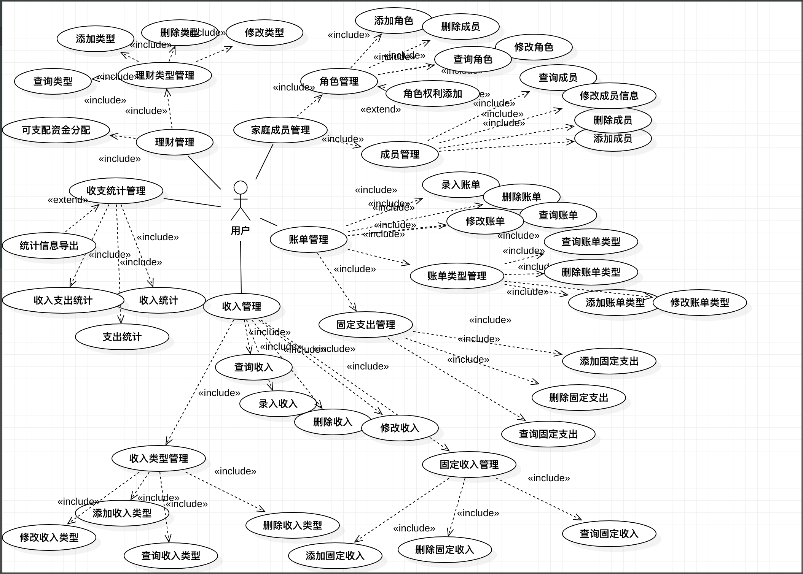
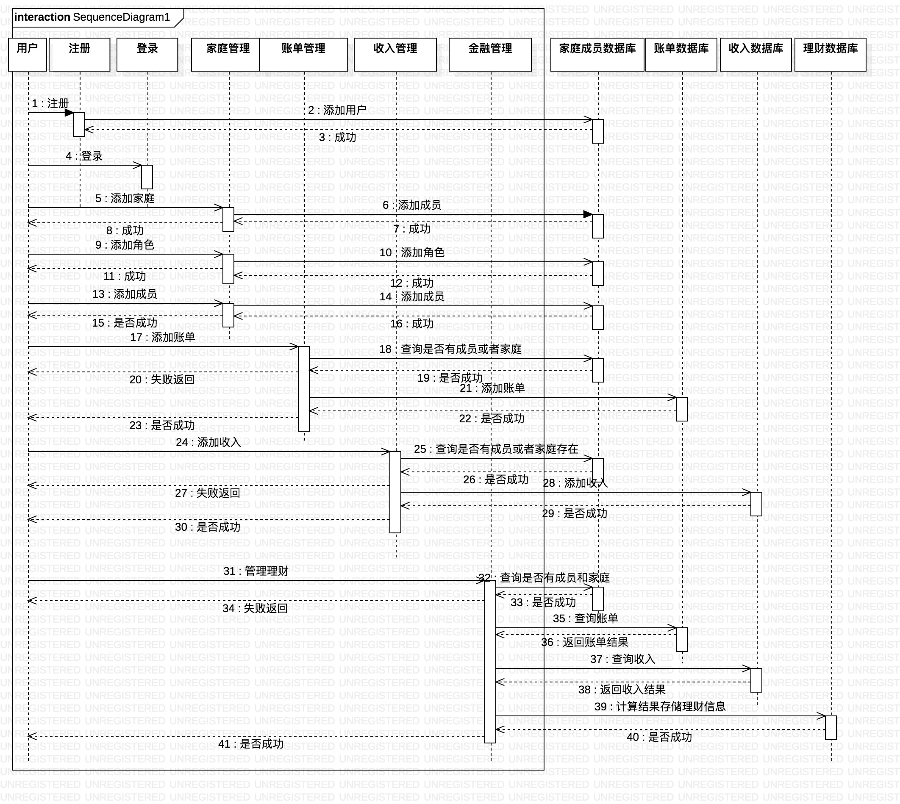
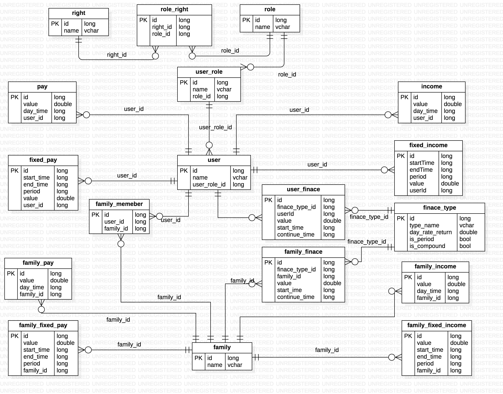

家庭金融管理系统设计文档
=====================
# 一.需求分析
该系统提供家庭金融管理功能，旨在为家庭提供一个便捷的记账和理财收入记录工具，假如你是一位家庭主妇或者家庭的金钱的管家，这款应用将大大增加你记账的效率并且为你提供以月年为周期的账目统计。
 ## 功能介绍：
（1）支持录入，修改，删除和查询家庭成员和所有家庭成员的角色。  
（2）支持录入，修改，删除和查询每天各项的收入和支出。  
（3）支持录入，修改，删除和查询固定收入。  
（4）支持月度，季度，年度等收支统计。  
（5）支持录入，修改删除和查询各项资金的分配使用。  
（6）其他需要的功能后续添加。  
# 二.程序概要设计
## Usecase设计

## 流程图设计

## 数据库设计

# 三.程序详细设计
## 前台交互设计图
# 四.接口设计
## 注册&添加用户
## 登录
## 登出
## 查询用户信息
## 修改用户信息
## 删除用户
## 添加家庭
## 查询家庭信息
## 修改家庭信息
## 删除家庭
## 添加收入/支出
## 修改收入/支出
## 查询收入/支出
## 删除收入/支出

# 五.安全设计
## 使用Https
## 使用session控制登录状态
## 输入校验
（1） XSS注入校验
（2） SQL注入校验
## 输出编码

# 六.系统设计
express + mongodb + React + material-ui + TypeScript

sudo mongod --dbpath=/usr/local/software/mongodb-macos-x86_64-4.4.2/data/db

cd /usr/local/software/mongodb-macos-x86_64-4.4.2/bin
sudo ./mongo

cd /Users/WHY/NodejsProject/Node/adminMongo
npm start

http://localhost:1234/

cd /Users/WHY/NodejsProject/Node/FamilyFinance/project
npm run server
npm run build
npm run tsc

http://127.0.0.1:3030

cd /Users/WHY/NodejsProject/Node/FamilyFinance/project
npm run server

cd /Users/WHY/NodejsProject/Node/FamilyFinance/project
npm run client_server

http://127.0.0.1:3030

2021.01.03:实现连接数据库数据的读取，问题，需要指定模型对应的Collection的名字，创建的时候需要用3哥参数  https://blog.csdn.net/weixin_30613727/article/details/96130850
